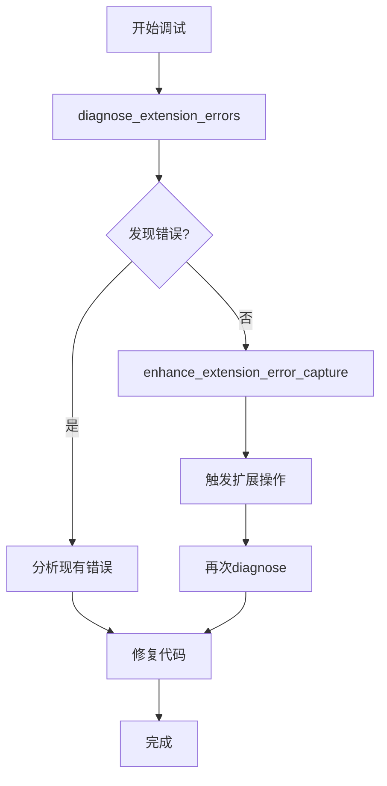

# 扩展错误工具关系说明

## 📋 工具对比

### 两个独立但互补的工具

| 工具 | `diagnose_extension_errors` | `enhance_extension_error_capture` |
|------|---------------------------|--------------------------------|
| **性质** | 只读分析工具 | 侵入式增强工具 |
| **职责** | 分析现有错误数据 | 增强错误捕获能力 |
| **副作用** | 无 | 注入代码到扩展运行时 |
| **使用时机** | 随时可用 | 需要先激活SW |
| **持久性** | 每次独立分析 | 持续生效直到扩展重载 |
| **readOnlyHint** | true | false |

---

## 🔄 工作流程

### 完整的错误诊断流程



### 推荐使用顺序

#### 场景1：调试已知错误

```bash
# 1. 直接诊断
diagnose_extension_errors({
  extensionId: "xxx",
  timeRange: 60,
  includeWarnings: true
})

# 2. 查看详细日志
get_extension_logs({
  extensionId: "xxx",
  level: ["error", "warn"]
})
```

#### 场景2：捕获难以复现的错误

```bash
# 1. 增强错误捕获
enhance_extension_error_capture({
  extensionId: "xxx",
  captureStackTraces: true
})

# 2. 触发可能导致错误的操作
# (用户手动操作扩展)

# 3. 诊断分析
diagnose_extension_errors({
  extensionId: "xxx",
  timeRange: 10
})
```

#### 场景3：生产监控

```bash
# 1. 首次启用增强捕获
enhance_extension_error_capture({
  extensionId: "xxx"
})

# 2. 定期检查
# (每小时或当用户报告问题时)
diagnose_extension_errors({
  extensionId: "xxx",
  timeRange: 60
})
```

---

## 🎯 设计理念

### 为什么不合并？

#### 1. **职责分离原则** ⭐⭐⭐

```typescript
// diagnose_extension_errors
职责：分析和诊断
输入：扩展ID
处理：读取日志 → 分类 → 统计 → 建议
输出：诊断报告

// enhance_extension_error_capture
职责：增强捕获
输入：扩展ID
处理：注入监听器 → 捕获错误 → 记录日志
输出：增强状态
```

**合并后的问题**：
- 职责混乱（一个工具做两件事）
- 用户无法选择是否注入代码
- 无法独立调用诊断功能

#### 2. **侵入性差异** ⭐⭐⭐

```
diagnose_extension_errors:
  ✅ 只读操作
  ✅ 无副作用
  ✅ 随时可用
  ✅ 安全性高

enhance_extension_error_capture:
  ⚠️ 修改运行时
  ⚠️ 注入代码
  ⚠️ 需要权限
  ⚠️ 有生命周期
```

**用户选择权**：
- 大多数情况只需要诊断（只读）
- 只有特殊情况需要增强（侵入）

#### 3. **生命周期不同** ⭐⭐

```
diagnose_extension_errors:
  调用 → 分析 → 返回结果 → 结束
  (无状态保存)

enhance_extension_error_capture:
  调用 → 注入监听器 → 持续监听 → 直到扩展重载
  (有状态保存)
```

#### 4. **数据流向清晰** ⭐

```
当前架构（推荐）:
┌─────────────────────────────────────┐
│ enhance_extension_error_capture     │
│ (增强数据源)                         │
└──────────┬──────────────────────────┘
           │ 注入监听器
           ▼
┌─────────────────────────────────────┐
│ 扩展运行时                           │
│ (产生更多错误日志)                   │
└──────────┬──────────────────────────┘
           │ console.error()
           ▼
┌─────────────────────────────────────┐
│ diagnose_extension_errors           │
│ (分析增强后的数据)                   │
└─────────────────────────────────────┘

合并后（不推荐）:
┌─────────────────────────────────────┐
│ diagnose_extension_errors           │
│   if (enhance) 注入代码 ← 职责混乱   │
│   分析错误                           │
└─────────────────────────────────────┘
```

---

## 💡 协作模式

### 模式1：诊断优先（90%场景）

```typescript
// 大多数情况下，现有日志已足够
await diagnose_extension_errors({
  extensionId: "xxx"
});

// 如果发现错误 → 修复代码
// 如果没有错误 → 问题可能是未捕获的错误 → 转到模式2
```

### 模式2：增强+诊断（10%场景）

```typescript
// 1. 增强捕获（一次性）
await enhance_extension_error_capture({
  extensionId: "xxx"
});

// 2. 触发操作（手动或自动）
// ...

// 3. 诊断分析（多次）
await diagnose_extension_errors({
  extensionId: "xxx"
});
```

### 模式3：CI/CD集成

```bash
# 部署前自动检查
#!/bin/bash

# 加载扩展
EXTENSION_ID=$(load_extension "path/to/extension")

# 增强错误捕获
enhance_extension_error_capture '{"extensionId":"'$EXTENSION_ID'"}'

# 运行自动化测试
run_tests

# 诊断错误
REPORT=$(diagnose_extension_errors '{"extensionId":"'$EXTENSION_ID'"}')

# 检查健康分数
SCORE=$(echo $REPORT | jq '.healthScore')
if [ $SCORE -lt 80 ]; then
  echo "Health score too low: $SCORE"
  exit 1
fi
```

---

## 📊 对比表格

### 功能覆盖

| 功能 | diagnose | enhance | 组合使用 |
|------|----------|---------|----------|
| **捕获console错误** | ✅ | - | ✅ |
| **捕获未处理错误** | ⚠️ 部分 | ✅ | ✅✅ |
| **捕获Promise拒绝** | ⚠️ 部分 | ✅ | ✅✅ |
| **错误分类** | ✅ | - | ✅ |
| **错误统计** | ✅ | - | ✅ |
| **堆栈跟踪** | ✅ | ✅ | ✅ |
| **诊断建议** | ✅ | - | ✅ |
| **健康评分** | ✅ | - | ✅ |
| **持续监控** | - | ✅ | ✅ |

### 使用成本

| 方面 | diagnose | enhance | 组合 |
|------|----------|---------|------|
| **学习成本** | 低 | 中 | 中 |
| **调用复杂度** | 简单 | 简单 | 中等 |
| **副作用** | 无 | 有 | 有 |
| **性能影响** | 极小 | 极小 | 极小 |
| **维护成本** | 低 | 低 | 低 |

---

## 🛠️ 实际案例

### 案例1：用户报告"扩展有时会崩溃"

```bash
# 步骤1：先看现有错误
diagnose_extension_errors({extensionId: "xxx"})
# 结果：没有发现错误

# 步骤2：增强捕获
enhance_extension_error_capture({extensionId: "xxx"})

# 步骤3：让用户重现问题
# (用户操作扩展)

# 步骤4：再次诊断
diagnose_extension_errors({extensionId: "xxx"})
# 结果：发现未处理的Promise拒绝！
```

### 案例2：定期健康检查

```typescript
// 每天凌晨3点运行
async function dailyHealthCheck() {
  const extensions = await list_extensions();
  
  for (const ext of extensions) {
    // 只需诊断，不需要增强
    const report = await diagnose_extension_errors({
      extensionId: ext.id,
      timeRange: 1440  // 24小时
    });
    
    if (report.healthScore < 80) {
      sendAlert(`Extension ${ext.name} health: ${report.healthScore}`);
    }
  }
}
```

### 案例3：开发调试

```typescript
// 开发新功能时
async function developmentDebug() {
  const extensionId = "xxx";
  
  // 启用增强捕获（开发期间一直保持）
  await enhance_extension_error_capture({
    extensionId,
    captureStackTraces: true
  });
  
  // 开发过程中随时诊断
  while (developing) {
    // ... 修改代码 ...
    await reload_extension({extensionId});
    
    // 重新增强（因为reload会清除）
    await enhance_extension_error_capture({extensionId});
    
    // ... 测试功能 ...
    
    // 检查错误
    await diagnose_extension_errors({
      extensionId,
      timeRange: 5
    });
  }
}
```

---

## 🎓 最佳实践建议

### ✅ 推荐做法

1. **默认使用诊断工具**
   ```bash
   diagnose_extension_errors({extensionId: "xxx"})
   ```

2. **需要时再增强**
   ```bash
   # 仅在以下情况使用：
   # - 现有日志不足
   # - 需要捕获Promise错误
   # - 生产环境监控
   enhance_extension_error_capture({extensionId: "xxx"})
   ```

3. **增强后定期诊断**
   ```bash
   # 增强是一次性的
   enhance_extension_error_capture(...)
   
   # 诊断可以多次调用
   diagnose_extension_errors(...)  # 每小时
   diagnose_extension_errors(...)  # 收到报告后
   ```

### ❌ 避免的做法

1. **不要每次诊断前都增强**
   ```bash
   # ❌ 错误
   enhance_extension_error_capture({extensionId: "xxx"})
   diagnose_extension_errors({extensionId: "xxx"})
   # (增强是持久的，不需要重复调用)
   ```

2. **不要在生产环境频繁增强**
   ```bash
   # ❌ 错误
   setInterval(() => {
     enhance_extension_error_capture(...)  # 浪费资源
   }, 60000)
   
   # ✅ 正确
   enhance_extension_error_capture(...)  # 仅一次
   setInterval(() => {
     diagnose_extension_errors(...)  # 定期诊断
   }, 60000)
   ```

---

## 📈 总结

### 两个工具的定位

```
enhance_extension_error_capture:
  └─ 数据源增强器
     └─ 让扩展产生更多错误日志

diagnose_extension_errors:
  └─ 数据分析器
     └─ 分析和诊断错误日志
```

### 为什么独立比合并好？

| 优势 | 独立工具 | 合并工具 |
|------|----------|----------|
| **职责清晰** | ✅ 各司其职 | ❌ 职责混乱 |
| **用户选择** | ✅ 按需使用 | ❌ 强制增强 |
| **代码维护** | ✅ 解耦独立 | ❌ 耦合复杂 |
| **测试简单** | ✅ 单元测试 | ❌ 集成测试 |
| **扩展性** | ✅ 易于扩展 | ❌ 难以扩展 |

### 协作关系

```
enhance 是 diagnose 的数据源增强器
diagnose 是 enhance 的数据消费者

两者相互独立，可以单独使用
但组合使用效果最佳
```

---

**结论**：两个工具应该保持独立，通过清晰的协作模式共同完成扩展错误诊断任务。
