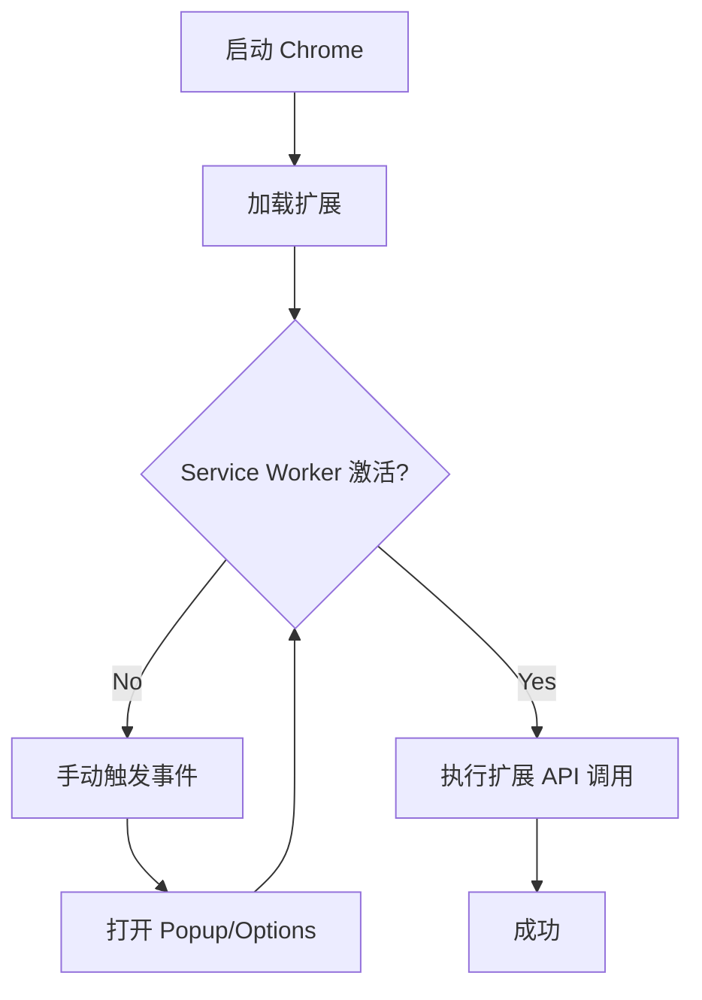

# MV3 Service Worker 激活指南

## ❗ 问题说明

Chrome MV3 扩展使用 Service Worker 作为后台脚本。Service Worker 默认处于 **Inactive（休眠）** 状态，在此状态下：

- ✅ 可以执行基本 JavaScript 代码（如 `1 + 1`）
- ✅ 可以访问全局对象（如 `self`）
- ❌ **无法访问** `chrome.*` API（如 `chrome.storage`、`chrome.tabs` 等）

## 🎯 如何激活 Service Worker

### 方法 1: 手动触发扩展事件（推荐）

在 Chrome 中执行以下任一操作：

1. **打开扩展 Popup**
   - 点击扩展图标
   - 或访问 `chrome-extension://[扩展ID]/popup.html`

2. **访问匹配的网页**
   - 如果扩展配置了 content_scripts
   - 访问匹配规则的网页会激活 Service Worker

3. **打开 Options 页面**
   ```
   chrome-extension://[扩展ID]/options.html
   ```

4. **手动激活（通过 DevTools）**
   - 打开 `chrome://extensions/`
   - 找到扩展，点击 "Service worker"
   - 会自动激活并打开 DevTools

### 方法 2: 使用测试扩展的内置激活

测试扩展 `test-extension-enhanced` 包含一个自动激活机制：

```javascript
// background.js 会在安装时写入初始数据
chrome.runtime.onInstalled.addListener(() => {
  chrome.storage.local.set({
    installed: true,
    timestamp: Date.now(),
  });
});
```

**触发方式：** 重新加载扩展
```
evaluate_in_extension extensionId=xxx code="chrome.runtime.reload()"
```

### 方法 3: 通过代码激活

在扩展内部触发一个简单事件：

```javascript
// 发送一个消息给自己
chrome.runtime.sendMessage({type: 'ping'});

// 或者创建一个 alarm
chrome.alarms.create('wakeup', {when: Date.now() + 1000});
```

## 🧪 验证激活状态

使用以下代码检查 Service Worker 是否激活：

```javascript
// 方法 1: 检查 chrome.storage 可用性
evaluate_in_extension extensionId=xxx code="typeof chrome !== 'undefined' && typeof chrome.storage !== 'undefined'"

// 方法 2: 尝试读取 Storage
evaluate_in_extension extensionId=xxx code="
  (async () => {
    try {
      const data = await chrome.storage.local.get(null);
      return {activated: true, keys: Object.keys(data)};
    } catch (e) {
      return {activated: false, error: e.message};
    }
  })()
"
```

## 📊 激活状态表

| 状态 | chrome.* API | 基本 JS | 说明 |
|------|-------------|---------|------|
| **Inactive** | ❌ 不可用 | ✅ 可用 | 默认休眠状态 |
| **Active** | ✅ 可用 | ✅ 可用 | 已激活状态 |

## 🔧 工具使用建议

### 读取 Storage 的正确方式

```javascript
// 1. 先激活 Service Worker（手动打开扩展 popup）

// 2. 然后读取 Storage
inspect_extension_storage extensionId=xxx storageType=local

// 或使用 evaluate_in_extension
evaluate_in_extension extensionId=xxx code="
  await chrome.storage.local.get(null)
"
```

### 调试流程



## ⚠️ 常见错误

### 错误 1: "chrome.storage not available"

**原因：** Service Worker 未激活

**解决：** 
1. 打开扩展 popup
2. 或访问 `chrome://extensions/` 点击 Service worker

### 错误 2: "Cannot read properties of undefined"

**原因：** 尝试访问未定义的 chrome API

**解决：**
1. 检查 manifest.json 中是否声明了对应权限
2. 确保 Service Worker 已激活

### 错误 3: Storage 返回空对象

**原因：** Storage 确实为空（非错误）

**解决：** 先写入测试数据
```javascript
evaluate_in_extension extensionId=xxx code="
  await chrome.storage.local.set({test: 'value'})
"
```

## 📚 参考资料

- [Service Workers in Chrome Extensions](https://developer.chrome.com/docs/extensions/mv3/service_workers/)
- [Extension Lifecycle](https://developer.chrome.com/docs/extensions/mv3/background_migration/)
- [Storage API](https://developer.chrome.com/docs/extensions/reference/storage/)

## 💡 最佳实践

1. **调试前先激活**：在使用任何 `chrome.*` API 前，先手动触发扩展事件
2. **使用容错代码**：始终检查 API 是否可用
   ```javascript
   if (typeof chrome !== 'undefined' && chrome.storage) {
     // 使用 API
   }
   ```
3. **监控状态**：使用 `chrome://serviceworker-internals/` 查看 Service Worker 状态
4. **自动激活**：在扩展中添加 `onInstalled` 监听器写入初始数据
