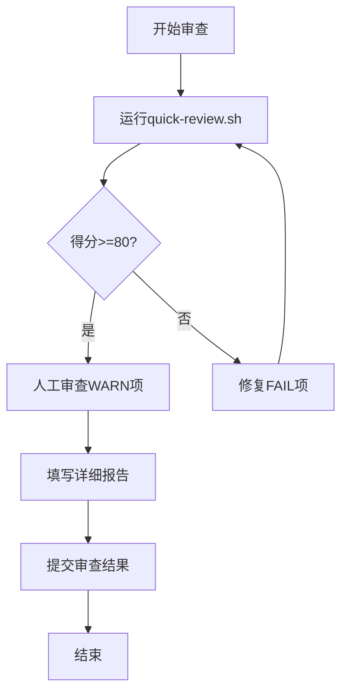

# 工程审查体系

本目录包含 Chrome Extension Debug MCP 项目的完整工程审查体系，用于确保代码质量符合规范、高效、优雅的标准。

---

## 📁 文件结构

```
docs/review/
├── README.md                          # 本文件 - 使用指南
├── ENGINEERING_REVIEW_PROMPT.md       # 核心 - 审查清单和评分标准
└── REVIEW_REPORT_TEMPLATE.md          # 报告模板

scripts/
└── quick-review.sh                     # 快速自动化审查脚本
```

---

## 🎯 快速开始

### 5分钟快速审查

```bash
# 审查单个文件或目录
./scripts/quick-review.sh src/tools/extension/new-tool.ts

# 审查整个tools模块
./scripts/quick-review.sh --full

# 审查特定目录
./scripts/quick-review.sh src/tools/extension/
```

**输出示例**:

```
🔍 Chrome Extension Debug MCP - 快速工程审查
━━━━━━━━━━━━━━━━━━━━━━━━━━━━━━━━━━━━━━━━━━━━━━
审查路径: src/tools/extension/
审查时间: 2025-10-26 12:40:00

1️⃣  代码设计模式 (30分)
━━━━━━━━━━━━━━━━━━━━━━━━━━━━━━━━━━━━━━━━━━━━━━

1.1 第一性原理: 业务失败不抛异常
✅ PASS - 无业务异常 (100%符合第一性原理) (+10分)

1.2 明确副作用: readOnlyHint标记
✅ PASS - 所有工具 (12/12) 都有readOnlyHint (+5分)

...

📊 审查结果汇总
━━━━━━━━━━━━━━━━━━━━━━━━━━━━━━━━━━━━━━━━━━━━━━
总分: 85/100
等级: B (良好)

✅ 代码质量良好，符合工程标准。
💡 建议: 查看WARN项，进一步优化。
```

### 30分钟完整审查

```bash
# 1. 运行快速审查
./scripts/quick-review.sh --full > quick-review-$(date +%Y%m%d).txt

# 2. 复制报告模板
cp docs/review/REVIEW_REPORT_TEMPLATE.md review-$(date +%Y%m%d).md

# 3. 打开审查清单
cat docs/review/ENGINEERING_REVIEW_PROMPT.md

# 4. 逐项人工审查，填写报告
# 编辑 review-YYYYMMDD.md

# 5. 运行测试
npm test -- --coverage

# 6. 完成报告
```

---

## 📋 审查维度

### 核心原则

**第一性原理**: 工具调用应该永远成功，只有结果可以失败

**六大设计原则**:

1. 极简主义
2. 防御编程
3. 参数验证优先
4. 职责单一
5. 业务失败不抛异常
6. 明确副作用

### 评分标准 (总分100分)

| 维度         | 权重 | 关键检查项               |
| ------------ | ---- | ------------------------ |
| 代码设计模式 | 30%  | 第一性原理、六大原则实施 |
| 错误处理规范 | 25%  | 统一框架、catch/try块    |
| 工具开发标准 | 15%  | 描述规范、handler结构    |
| 架构一致性   | 10%  | 代码模式、文件组织       |
| 性能与效率   | 10%  | 避免过度工程化、代码复用 |
| 文档质量     | 5%   | 注释、工具文档           |
| 测试覆盖     | 5%   | 单元测试、集成测试       |

### 等级划分

- **A (90-100)**: 优秀，可作为最佳实践参考
- **B (80-89)**: 良好，符合工程标准
- **C (70-79)**: 及格，需要一些改进
- **D (60-69)**: 不及格，需要重大改进
- **F (<60)**: 严重不合格，需要重写

---

## 🛠️ 使用场景

### 场景1: PR审查

```bash
# 1. 获取PR改动的文件
git diff --name-only main...feature-branch

# 2. 审查每个文件
for file in $(git diff --name-only main...feature-branch | grep "src/tools"); do
  ./scripts/quick-review.sh "$file"
done

# 3. 在PR评论中提供审查结果
```

### 场景2: 新工具开发

**开发前**:

1. 阅读 `ENGINEERING_REVIEW_PROMPT.md`
2. 查看最佳实践示例（如 `src/tools/pages.ts`）
3. 使用快速自查清单

**开发中**:

1. 遵循handler标准结构
2. 使用ErrorReporting统一报告
3. 添加readOnlyHint标记

**开发后**:

1. 运行 `./scripts/quick-review.sh`
2. 确保10项必需项全部✅
3. 编写单元测试

### 场景3: 代码重构

```bash
# 1. 记录重构前得分
./scripts/quick-review.sh src/tools/extension/ > before.txt

# 2. 执行重构
# ... 修改代码 ...

# 3. 记录重构后得分
./scripts/quick-review.sh src/tools/extension/ > after.txt

# 4. 对比改进
diff before.txt after.txt
```

### 场景4: 质量审计

**月度/季度审计**:

```bash
# 1. 全局审查
./scripts/quick-review.sh --full > audit-$(date +%Y%m).txt

# 2. 生成详细报告
cp docs/review/REVIEW_REPORT_TEMPLATE.md audit-$(date +%Y%m).md

# 3. 识别需要改进的模块

# 4. 制定改进计划
```

---

## ✅ 快速自查清单

提交代码前，请确认：

### 必需项（10项全部✅才能提交）

- [ ] **业务失败返回信息**，不抛异常
- [ ] **参数验证在handler开头**
- [ ] **使用try-finally清理资源**（CDP Session等）
- [ ] **有readOnlyHint标记**
- [ ] **handler结构清晰**（验证→获取→执行）
- [ ] **catch块简洁**（<5行）
- [ ] **工具描述适中**（12-20行）
- [ ] **有错误常量定义**（如需要）
- [ ] **使用ErrorReporting统一报告**
- [ ] **有单元测试**（核心逻辑）

### 推荐项

- [ ] 有集成测试
- [ ] 有使用文档
- [ ] 代码有关键注释
- [ ] 遵循命名规范

**检查命令**:

```bash
# 一键检查所有必需项
./scripts/quick-review.sh src/your/file.ts | grep "FAIL"
# 如果无输出，说明基本合格
```

---

## 📊 审查流程

### 标准流程



### 快速流程（日常开发）

1. **提交前**: 运行 `./scripts/quick-review.sh <file>`
2. **检查**: 确保无FAIL项
3. **修复**: 修复所有FAIL项和重要WARN项
4. **提交**: 代码提交

### 完整流程（重要PR/发布前）

1. **自动审查**: 运行快速审查脚本
2. **人工审查**: 使用完整清单逐项检查
3. **填写报告**: 使用报告模板记录
4. **讨论**: 与团队讨论重要发现
5. **改进**: 执行改进计划
6. **复审**: 再次审查确认
7. **归档**: 保存审查报告

---

## 🎓 最佳实践

### 黄金标准: close_page模式

**文件**: `src/tools/pages.ts`

```typescript
// 1. 定义错误常量
const CLOSE_PAGE_ERROR = 'Cannot close the last page';

// 2. 工具定义
export const closePage = defineTool({
  name: 'close_page',
  description: '...',
  annotations: {
    category: ToolCategories.NAVIGATION_AUTOMATION,
    readOnlyHint: false, // 3. 明确副作用
  },
  schema: {
    /* ... */
  },
  handler: async (request, response, context) => {
    // 4. try-catch捕获特定错误
    try {
      await context.closePage(request.params.pageIdx);
    } catch (err) {
      if (err.message === CLOSE_PAGE_ERROR) {
        // 5. 预期错误返回信息
        response.appendResponseLine(err.message);
      } else {
        // 6. 意外错误继续抛出
        throw err;
      }
    }
    // 7. 设置输出
    response.setIncludePages(true);
  },
});
```

**学习要点**:

- ✅ 错误常量化
- ✅ 捕获特定错误
- ✅ 预期错误返回信息
- ✅ 意外错误继续抛出
- ✅ readOnlyHint明确
- ✅ handler结构清晰

### 其他参考示例

**资源管理**: `src/tools/input.ts`

```typescript
const client = await browser.createCDPSession();
try {
  await client.send('Input.dispatchKeyEvent', {...});
} finally {
  void client.detach(); // 确保释放
}
```

**简洁catch块**: `src/tools/navigation.ts`

```typescript
try {
  await page.goBack();
} catch {} // 空catch

response.appendResponseLine('Navigation completed');
```

---

## 🔧 工具说明

### quick-review.sh

**功能**: 自动化检查代码是否符合工程规范

**使用方法**:

```bash
./scripts/quick-review.sh [文件路径]
./scripts/quick-review.sh --full  # 审查整个项目
```

**检查项**:

- ✅ 业务异常检测
- ✅ readOnlyHint覆盖率
- ✅ handler行数统计
- ✅ ErrorReporting使用情况
- ✅ try-finally资源管理
- ✅ 错误常量定义
- ✅ catch块检测
- ✅ 文件组织检查

**输出**:

- 各维度得分
- PASS/WARN/FAIL标记
- 总分和等级
- 改进建议

**限制**:

- 无法检查代码逻辑正确性
- 无法评估算法效率
- catch块/try块需要人工确认行数

---

## 📚 相关文档

### 核心文档

- **[ENGINEERING_REVIEW_PROMPT.md](./ENGINEERING_REVIEW_PROMPT.md)** - 完整审查清单（必读）
- **[REVIEW_REPORT_TEMPLATE.md](./REVIEW_REPORT_TEMPLATE.md)** - 报告模板

### 参考文档

- [错误处理修复报告](../archive/error-handling/ERROR_HANDLING_FIX_REPORT.md)
- [第一性原理分析](../TOOL_ERROR_HANDLING_ANALYSIS.md)
- [Phase 4优化完成](../PHASE4_OPTIMIZATION_COMPLETE.md)

### 代码示例

**原始工具**（黄金标准）:

- `src/tools/pages.ts` - close_page模式
- `src/tools/input.ts` - try-finally模式
- `src/tools/navigation.ts` - 简洁catch模式

**扩展工具**（优化后）:

- `src/tools/extension/execution.ts`
- `src/tools/extension/discovery.ts`
- `src/tools/extension/runtime-errors.ts`

---

## ❓ 常见问题

### Q1: 快速审查脚本为什么给了WARN？

**A**: WARN表示部分符合标准但有改进空间。查看具体提示：

- 如果是"需人工检查"，使用完整清单人工确认
- 如果是覆盖率问题，补充缺失的部分
- 如果是代码行数，考虑重构简化

### Q2: 什么时候需要完整审查？

**A**: 以下情况建议完整审查：

- 重要功能的PR
- 新工具开发
- 版本发布前
- 代码重构后
- 月度/季度质量审计

### Q3: 审查发现问题如何优先级排序？

**A**:

- **P0**: FAIL项，必须立即修复
- **P1**: 重要WARN项，影响质量
- **P2**: 一般WARN项，可延后处理

### Q4: 如何将审查融入开发流程？

**A**: 建议的Git Hooks:

```bash
# .git/hooks/pre-commit
#!/bin/bash
./scripts/quick-review.sh $(git diff --cached --name-only | grep "src/tools")
```

---

## 🚀 持续改进

### 审查体系迭代

1. **收集反馈**: 使用中的问题和建议
2. **更新清单**: 发现新的最佳实践
3. **优化脚本**: 增加自动检测能力
4. **完善文档**: 补充案例和说明

### 贡献方式

- 提交Issue: 报告审查体系的问题
- 提交PR: 改进审查清单或脚本
- 分享经验: 补充最佳实践案例
- 讨论: 参与审查标准的讨论

---

## 📞 联系方式

- **Issues**: https://github.com/ChromeDevTools/chrome-devtools-mcp/issues
- **Discussions**: https://github.com/ChromeDevTools/chrome-devtools-mcp/discussions

---

**版本**: 1.0  
**创建日期**: 2025-10-26  
**维护者**: AI Assistant + Community
